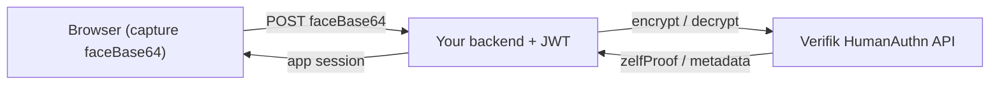

# Integration examples

Reference examples for dropping [`humanauthn`](https://pypi.org/project/humanauthn/)
into an existing app. They are illustrative snippets (not linted, type-checked,
or packaged by the SDK build) and keep the Verifik JWT server-side.

| Example | What it shows |
| --- | --- |
| [flask/](flask) | Flask `enroll` + `authenticate` routes |
| [fastapi/](fastapi) | FastAPI `enroll` + `authenticate` routes |
| [browser/](browser) | Capture `faceBase64` from a webcam and POST it |

Typical flow:

You need a Verifik client JWT in `VERIFIK_CLIENT_JWT` — see the repo root
[Authentication](../../README.md#authentication-verifik-jwt) section.
